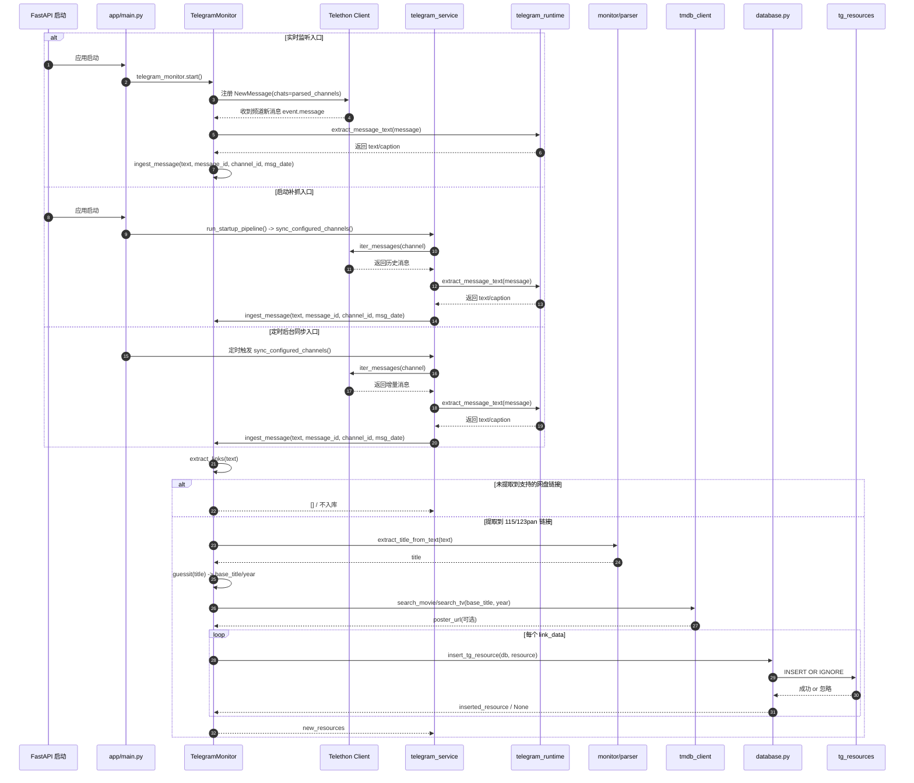
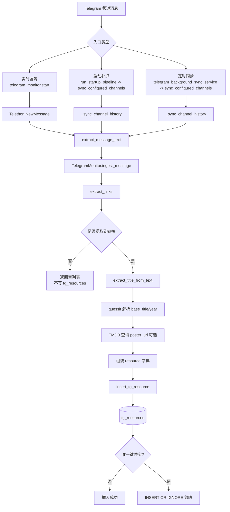
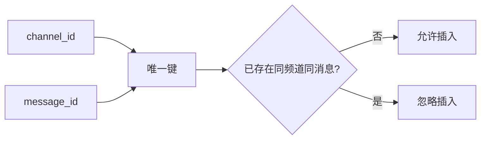
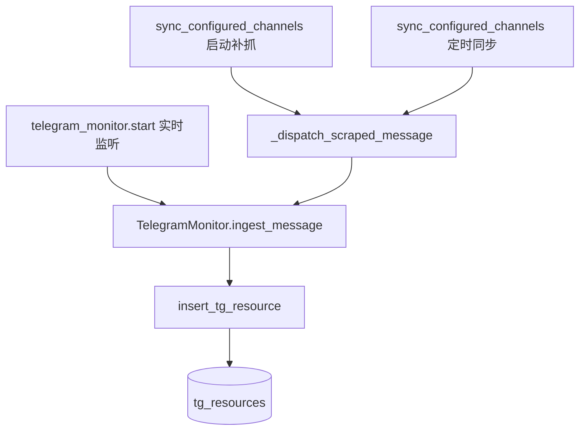

# Telegram 到 `tg_resources` 入库链路梳理

本文只聚焦一段逻辑：**Telegram 频道消息进入系统，直到写入 `tg_resources`**。

不展开后续自动转存、115 接收、整理归档等流程。

## 总体结论

项目里有 3 条入口会把 Telegram 消息送进同一套入库逻辑：

1. 实时监听
2. 启动时历史/增量补抓
3. 定时后台增量同步

这三条入口最终都会进入同一个核心方法：`TelegramMonitor.ingest_message()`，然后调用 `insert_tg_resource()` 写入 `tg_resources`。

相关核心文件：

- `app/main.py`
- `app/core/monitor/telegram.py`
- `app/services/telegram_service.py`
- `app/services/telegram_background_service.py`
- `app/database.py`

## 时序图

## 调用链图

## 三条入口的落点

### 1. 实时监听

入口位于 `app/main.py`：

- 应用启动后，如果 `config.monitor.telegram.enabled` 为真，会异步启动 `telegram_monitor.start()`。

对应代码位置：

- `app/main.py`
- `app/core/monitor/telegram.py`

逻辑：

1. `TelegramMonitor.start()` 创建 `Telethon` 客户端。
2. 根据配置解析监听频道。
3. 注册 `@self.client.on(events.NewMessage(...))`。
4. 收到消息后，先提取正文，再按关键词过滤。
5. 通过 `ingest_message(...)` 进入统一入库逻辑。

### 2. 启动补抓

入口位于 `app/services/startup_bootstrap_service.py`。

当启动流水线满足以下条件时：

- `pipeline.run_telegram_sync` 为真
- Telegram 监听开启
- `startup_sync != "disabled"`
- 配置了 `api_id`、`api_hash`、`channels`

系统会在启动阶段执行：

- `sync_configured_channels(...)`

随后每条历史消息会经由：

- `_sync_channel_history(...)`
- `_dispatch_scraped_message(...)`
- `telegram_monitor.ingest_message(...)`

### 3. 定时后台增量同步

入口位于 `app/services/telegram_background_service.py`。

应用启动时会注册定时任务：

- `telegram_background_sync_service.configure_scheduled_sync_job()`

任务触发后执行：

- `sync_configured_channels(..., emit_events=False, startup_mode="incremental")`

随后同样进入：

- `_sync_channel_history(...)`
- `_dispatch_scraped_message(...)`
- `telegram_monitor.ingest_message(...)`

## 统一消息正文提取

正文提取在 `app/core/monitor/telegram_runtime.py` 的 `extract_message_text(message)` 中统一处理。

规则如下：

1. 优先检查 `text`、`raw_text`、`message` 三个属性。
2. 如果某个字段里包含受支持的分享链接，则优先返回该字段。
3. 支持的链接类型目前只有：
   - `115/115cdn`
   - `123pan`
4. 如果没有命中链接字段，则退回普通文本字段。

这样做的目的是兼容不同消息类型，把 caption 和文本正文尽量统一到一条处理链上。

## 核心入库函数：`ingest_message`

真正的入库主逻辑位于 `app/core/monitor/telegram.py` 的 `TelegramMonitor.ingest_message()`。

处理步骤如下。

### 1. 提取链接

先调用 `extract_links(text)`：

- 识别 `115/115cdn` 和 `123pan` 链接
- 从正文里抽取“码/密码/提取码/访问码”作为兜底密码
- 同时支持从 URL query 中读取密码
- 清洗掉 query 参数，保留规范化链接
- 对单条消息内部重复 URL 去重

如果没有提取到任何支持的链接，直接返回空列表，不会写入 `tg_resources`。

### 2. 提纯标题

调用 `app/core/monitor/parser.py` 中的 `extract_title_from_text(text)`：

- 去掉链接
- 去掉提取码等噪声信息
- 去掉常见宣传/引导文本
- 按行扫描，取第一行有效文本作为标题

### 3. 解析媒体基础信息

在 `ingest_message()` 内继续做两步补充：

1. 用 `guessit(title)` 解析出 `base_title` 和 `year`
2. 调用 TMDB：
   - `search_movie(base_title, year)`
   - 若无结果，再调用 `search_tv(base_title, year)`

如果命中 TMDB 结果，会补充 `poster_url`。

### 4. 组装资源并入库

对消息中每个链接组装 `resource` 字典，字段包括：

- `message_id`
- `channel_id`
- `title`
- `raw_text`
- `link`
- `password`
- `disk_type`
- `msg_date`
- `status`
- `base_title`
- `poster_url`

随后调用 `insert_tg_resource(db, resource)` 执行真正的数据库写入。

## `tg_resources` 表结构

表定义位于 `app/database.py`。

主要字段如下：

- `id`
- `message_id`
- `channel_id`
- `title`
- `raw_text`
- `link`
- `password`
- `disk_type`
- `msg_date`
- `status`
- `base_title`
- `poster_url`
- `overview`
- `cast_text`
- `created_at`

对应去重相关索引：

- `idx_tg_resources_channel_message`

唯一键是：

- `(channel_id, message_id)`

## 唯一约束的实际含义

`insert_tg_resource()` 使用的是 `INSERT OR IGNORE`。

这意味着：

- 如果同一个 `channel_id + message_id` 已存在记录，则当前插入会被忽略
- 函数会返回 `None`
- 上层不会把这条记录加入 `new_resources`

## 一个容易忽略但很重要的事实

当前 `tg_resources` 的实际语义不是“每个链接一条记录”，而是：

**每个频道的一条 Telegram 消息，最多只会保留一条资源记录。**

原因如下：

1. `ingest_message()` 会遍历一条消息中提取到的多个链接。
2. 但数据库唯一键只有 `(channel_id, message_id)`。
3. 所以第一条链接插入成功后，后续同消息的其他链接都会命中唯一约束。
4. 后续链接会被 `INSERT OR IGNORE` 丢弃。

也就是说，如果一条 Telegram 消息里同时带了多个网盘链接，当前表设计下通常只会保留第一条成功插入的链接。

## 历史/增量同步如何决定抓到哪里

这部分虽然不属于 `tg_resources` 表本身，但和“是否继续抓消息”直接相关。

项目使用 `telegram_monitor_state` 记录频道抓取进度，主要字段包括：

- `channel_ref`
- `resolved_channel_id`
- `last_message_id`
- `last_message_date`
- `last_success_at`
- `last_error`

抓取流程里：

1. `_sync_channel_history()` 先读取该频道的 `last_message_id`
2. 遍历消息时，若遇到 `message.id <= stop_message_id` 就停止
3. 抓取完成后更新 `telegram_monitor_state`

另外还会用 `_channel_has_resources(...)` 检查该频道在 `tg_resources` 中是否已经存在资源：

- 如果状态表有记录，但 `tg_resources` 里实际上没有该频道资源
- 则会重置停止条件，重新补抓

因此：

- `telegram_monitor_state` 负责同步进度
- `tg_resources` 负责资源明细

两者分工不同，但协同决定历史消息是否继续扫描。

## 最终调用链汇总

## 结论摘要

1. 所有 Telegram 消息入库都收敛到 `TelegramMonitor.ingest_message()`。
2. `extract_message_text()` 负责统一正文提取。
3. `extract_links()` 决定消息是否具备入库资格。
4. `extract_title_from_text()`、`guessit`、TMDB 用于补齐标题和海报信息。
5. `insert_tg_resource()` 是唯一实际写表入口。
6. 当前 `tg_resources` 的唯一约束决定了“一条消息最多只保留一条记录”。